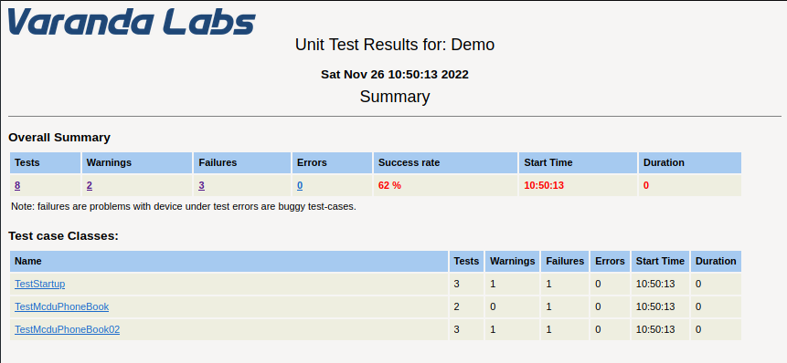
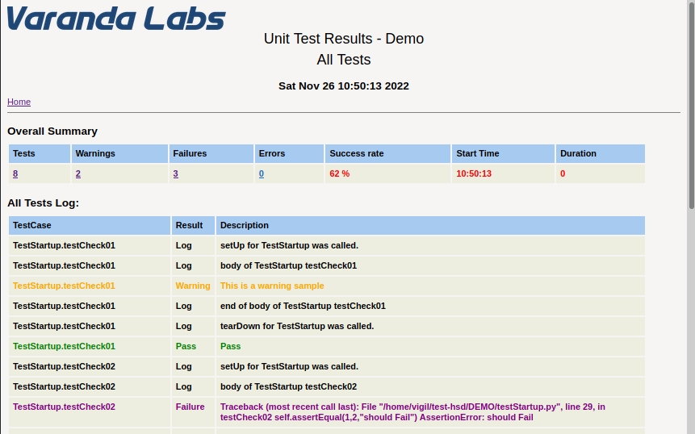

# Unit Test Harness
Copy the directory DEMO to a new name and modify the files/directory according to your needs.

# To Run
Requires Python version >= 2.6 and < 3.0
<br>
It does not rununder version 3.x
<br>
Under test-hsd directory run:
```
/usr/bin/python2.7 runtests.py
```

Test resuts are HTML files under: httpdir<br>
If you need a test file you can pipe the results to a text file, for example:
```
/usr/bin/python2.7 runtests.py > test-results.txt
```

# Screen shots
## Summary Page


## Result for all tests



